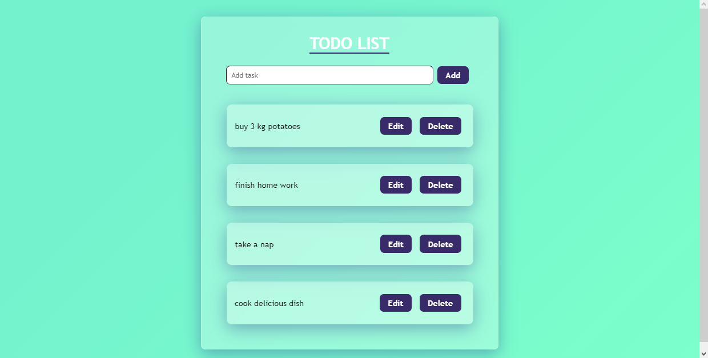

# TODO LIST

This is a simple todo app built with React.js and Css.


## Authors

- [@EronMahmuti](https://www.github.com/eronmahmuti)


## Color Reference

| Color             | Hex                                                                |
| ----------------- | ------------------------------------------------------------------ |
| Body Background color |  #0a192f |
| Body Background Color |  #f8f8f8 |
| Box-shadow Color |  #00b48a |
| Buttons Background Color |  #00d1a0 |
| H1 & Button text color |  #00d1a0 |


## Documentation

Based on
[React Beta Documentation](https://beta.reactjs.org)


## Features

- Glassmorphism
- Save, Edit, Delete, Add buttons
- Fullscreen mode
- Responsive


## Run Locally

Clone the project

```bash
  git clone https://link-to-project
```

Go to the project directory

```bash
  cd todoapp
```

Install dependencies

```bash
  npm install
```

Start the server

```bash
  npm run start
```

[Todoapp](https://todoeron.netlify.app)

